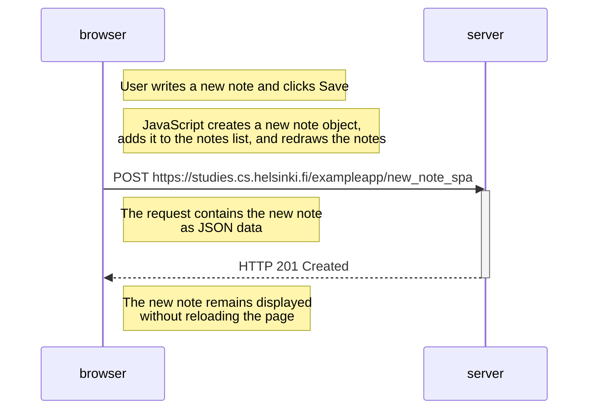

```mermaid
sequenceDiagram
    participant browser
    participant server

    Note right of browser: User writes a new note and clicks Save

    Note right of browser: JavaScript creates a new note object,<br/>adds it to the notes list, and redraws the notes

    browser->>server: POST https://studies.cs.helsinki.fi/exampleapp/new_note_spa
    activate server

    Note right of browser: The request contains the new note<br/>as JSON data

    server-->>browser: HTTP 201 Created
    deactivate server

    Note right of browser: The new note remains displayed<br/>without reloading the page
```